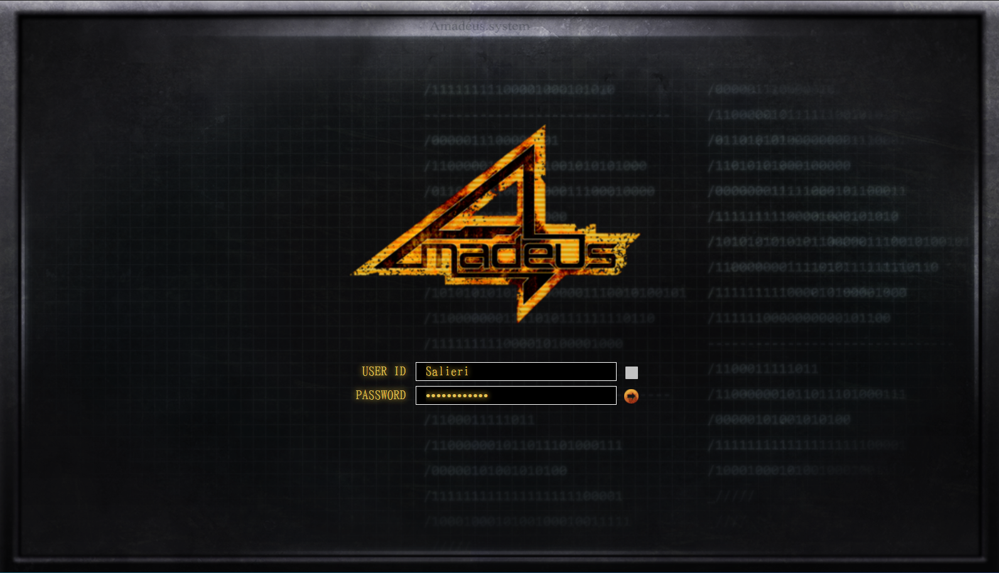

# dsm-amadeus

Custom login page CSS for DSM 6.x
Tested only from DSM 6.2. Use at your own risk.

## Examples

* Welcome text

* No Welcome text


## How to install
1. SSH into DSM
2. Run following commands:
```
$ sudo -i
$ wget https://github.com/kohs100/dsm-amadeus/raw/main/install.sh
$ chmod +x install.sh
$ ./install.sh
```
3. Set DSM theme background to [amadeus-background.png](./amadeus-background.png) from DSM control panel


## Credit

* [TakaoMincho Font](https://github.com/SumiTomohiko/UnnamedFukidashi/tree/master/takao-fonts-ttf)
* [sddm-theme-amadeus](https://github.com/Michal-Szczepaniak/sddm-theme-amadeus)

## Caution
Tested only from DSM 6.2. Use at your own risk.